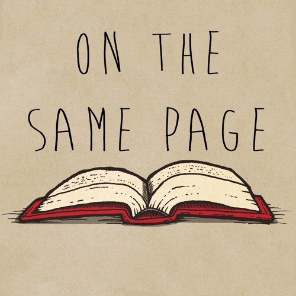

## What are coding standards?
Coding standards are a commonly used device by both senior and new-coming developers. An easy comparison would be to compare coding standards to grammar. For example, say a friend invites you to a party and you want to know when the party is. Would you ask him "when party" or "when is the party"? It's a simple answer that carries over into coding. While both responses do work, one is far more confusing and less cohesive than the other. That's what coding standards are meant to solve. It forces programmers to write in a uniform manner that makes code universally comprehensible. 

## Learning Curve
As with most things, there is definitely some difficulty with adhering to coding standards for the first time. I remember that I first had to adhere to standards in C and it was a pain in the butt to go back and forth running the script to verify that my code followed all the standards. It can be a lot to memorize especially when there's many kinds of standards across all languages. Thankfully lots of modern languages and IDE's allow you to have plugins that make suggestions to your code in real time such as ESLint for VSCode and IntelliJ. In ESLint's case, it's as simple as installing it and then it providing immediate feedback on your code to ensure that it follows the set guidelines.  
