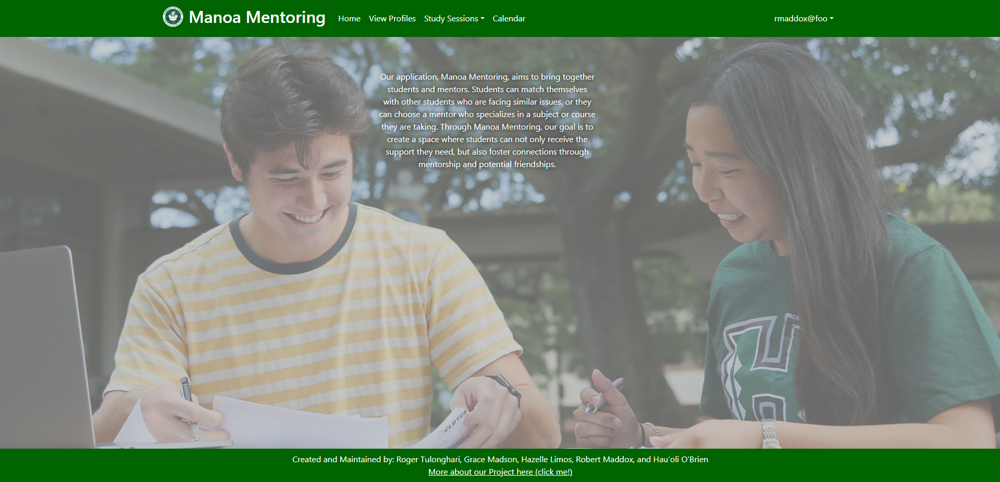

## [Manoa Mentoring](https://manoa-mentoring.site/)
Manoa Mentoring is a University of Hawaii centric application that allows students and mentors to organize, host, and promote tutoring sessions. It's a collaborative project we designed to provide an efficient method for students to engage in study sessions. Sessions can be created, joined, and edited to provided users customization and organization of sessions. We've also implemented a leveling system to promote users to engage in both hosting sessions and attending them. When setting up accounts, users have the option to set their major, location, and preference of session between Online, In-Person, or Both. 

Source code to the project can be found [here](https://github.com/manoa-mentoring).
[Project Page](https://manoa-mentoring.github.io/)
