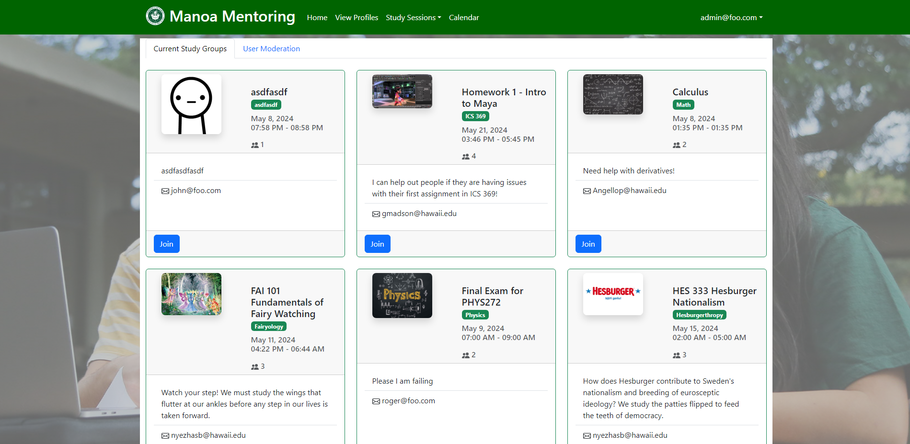

Landing Page

## [Manoa Mentoring](https://manoa-mentoring.site/)
Manoa Mentoring is a University of Hawaii centric application that allows students and mentors to organize, host, and promote tutoring sessions. It's a collaborative project we designed to provide an efficient method for students to engage in study sessions. Sessions can be created, joined, and edited to provided users customization and organization of sessions. We've also implemented a leveling system to promote users to engage in both hosting sessions and attending them. When setting up accounts, users have the option to set their major, location, and preference of session between Online, In-Person, or Both. 

[Source Code](https://github.com/manoa-mentoring)

[Project Page](https://manoa-mentoring.github.io/)

## My Role in the Process
There were 3 primary stages in the development of our project. They were broken down into 3 milestones. Across those three miletones some of my main contributions included:

Creating an administrative page that allowed moderation for users and sessions. 

Admin Page

Creating some of the data structures used across the site like the sessions structure which is frequently used. I included a snippet of the proptype declarations for the structure, very straightforward but also necesarry for the organization and maintenance down the line. I also ensured that it was properly published and functional.

~~~
StudySession.propTypes = {
  studySession: PropTypes.shape({
    name: PropTypes.string,
    subject: PropTypes.string,
    location: PropTypes.string,
    hostName: PropTypes.string,
    dateStart: PropTypes.instanceOf(Date),
    dateEnd: PropTypes.instanceOf(Date),
    image: PropTypes.string,
    description: PropTypes.string,
    owner: PropTypes.string,
    joinedUsers: PropTypes.arrayOf(PropTypes.string).isRequired,
    _id: PropTypes.string,
  }).isRequired,
  onDelete: PropTypes.func.isRequired, // Function to handle deletion
};
~~~

During out testing phases, I created the tests for the admin page, sign in, and sign up. As well as linking all of my peers tests together to ensure that the site passed everyone's individuals tests. These tests ensured that every function offered by the site worked and was recreatable regardless of credentials. Here's a snippet of the admin test.

~~~
class ListcontactsadminPage {
  constructor() {
    this.pageId = '#list-stuff-admin-nav';
    this.pageSelector = Selector(this.pageId);
  }

  /** Asserts that this page is currently displayed. */
  async isDisplayed(testController) {
    await testController.expect(this.pageSelector.exists).ok();
  }
}
~~~

## The Experience
Managing a project is not a simple task. A lot of time spent wasn't necessarily even coding related. We had to host meetings and calls just to discuss plans and how to map out our ideas and brainstorms. As previously mentioned, we had 3 phases of development. Each phase required meticulous planning and collaboration between one another. We used Discord frequently to communicate with one another presenting any issues, concerns, or ideas we had for the project. For this project I also learned a lot about time management and how important efficient pacing is for completing the project on schedule. Our process included using Github's issue feature, and we would use the time estimation figure when deciding who got what issue. This played a big role in how to pace our development and is something I plan on utilizing going forward, seeing how important it was to our time management. Thankfully communication was no issue within our group and I found it extremely important that every was being vocal and engaging with one another to not only promote a friendly environment but also to ensure that we were all on the same page. 

