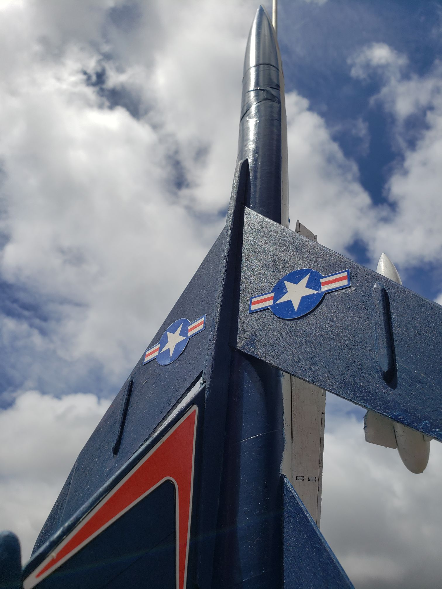
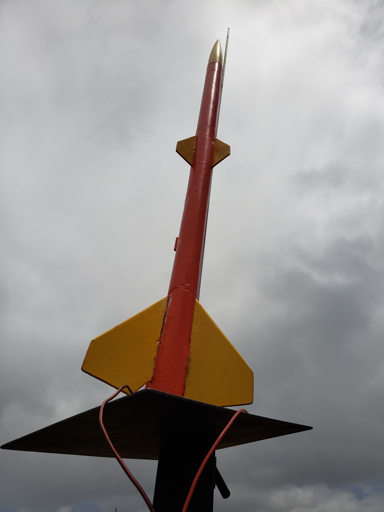

The American Rocketry Challenge is an important competition for all rocketry clubs. Qualifying for TARC is not easy. Qualification flights are verified by a TARC official and teams have limited attempts for their rocket to complete the specified objectives. Typically this objective involves storing eggs within the body of the rocket then achieving a specified altitude and duration and landing without damaging any of the eggs. These objectives are graded with a score and only the top 100 scoring teams will qualify for teh National Fly-Off held in virginia. 

At Mililani High School, our rocketry team took on the TARC Rocket Challenge. There were several struggles that arose with this endeavor. Financing was a huge problem for the Rocketry Club, and resulted in the host teacher paying for most of the expenses out of pocket. As the Treasurer, the Vice President of the club and made a presentation for the principal to propose funding for the club. Thankfully we did get it. 

That money went to lots of new equpiment and rocket kits. Since any rockets we lost would be detrimental to the clubs fleet. For the longest time we had no way to replace any of the rockets and equipment. Now that we had the funding we could begin working on our TARC rocket. TARC rockets have way higher standards than typical kit rockets. They're much larger and requires custom parts to gain peak performance. We ran simulations and started to 3D print pieces of the body to use. Unfortunately I don't have any pictures but we didn't finish the rocket in time for the official to review it. Although it proved to be a really intensive project that required teammwork, inginuity, and consistency.

