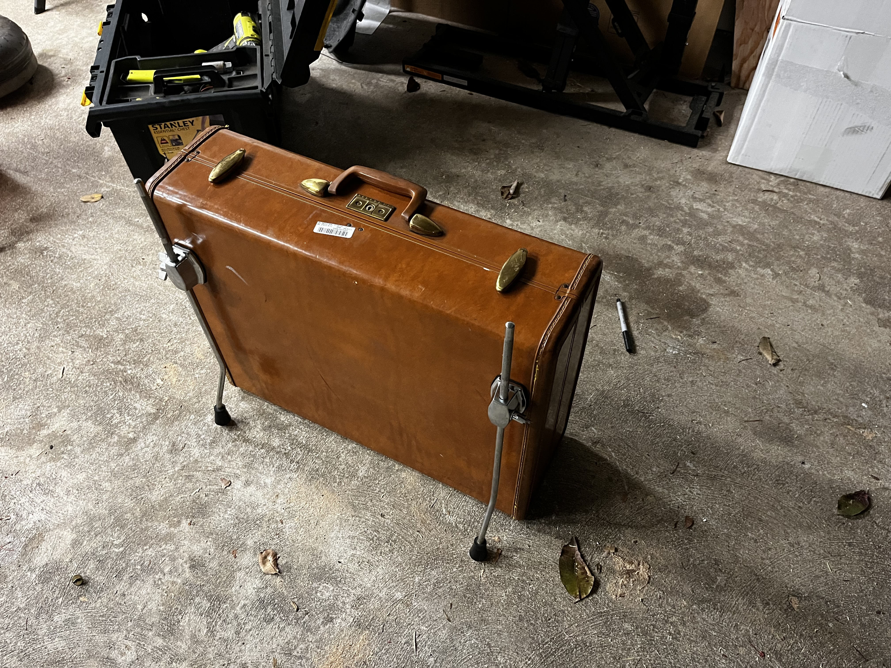

One of the many issues that pose problems to up and coming drummers is convienence. Let's face it, drumkits are unwieldly, large, and heavy. They're a pain in the butt to move around, pack, and setup. Well I saw this and posed an idea to create a drumkit to fix this. 

I've been in quite a few startup garage bands and only once did I have the benefit of practicing in a space with a drumkit already setup. Besides that, I had to take a kit with me or store one away. It could take 20-25 minutes to setup which is a large portion of time that could go to practicing. 

This is the first prototype I have of the "Suitcase Drumkit". It's essentially an ultra portable 4-piece kit that makes playing nearly anywhere possible.

### Time Efficiency
First off, teardown and setup times are vastly reduced compared to the traditional 7-piece kit. Setup is super simple and takes about 5 minutes, same for the teardown. Everything fits within the suitcase/bassdrum.

### Portability
Secondly, it's portability means that you can quite literally take this anywhere. I do not have a big car, that posed as an issue for events where I needed to bring a full drumkit. This kit fits in the trunk of my sedan and because if its small size, is flight ready. 

### Cost Effective
Finally, the price of parts is pretty fair regarding the competition. The concept of a portable drumkit is not mine entirely. Very profound leaders in the drumming world have made thin lighter drum shells to achieve similar results, however these could range in price from $500-$900. Not to mention that some of these kits have less features than mine. I picked up the suitcase for a couple bucks from a pawn shop and assembled all the hardware myself. Costs for the rest of the equipment could run you about $200-$300 depending on options. A steep drop in price when looking at competitors. 

## Suitcase Drumkit Demo

